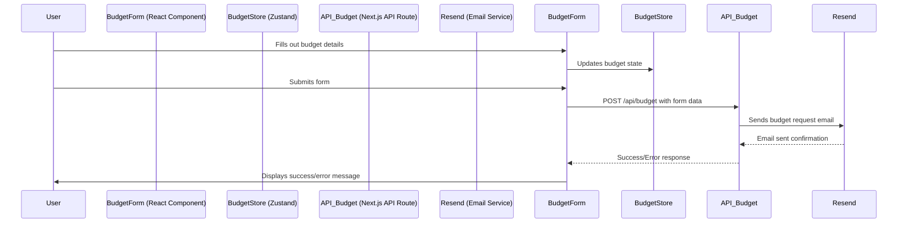
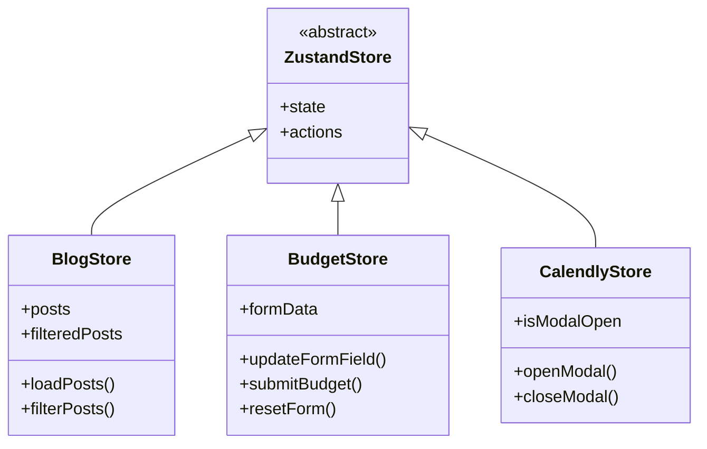
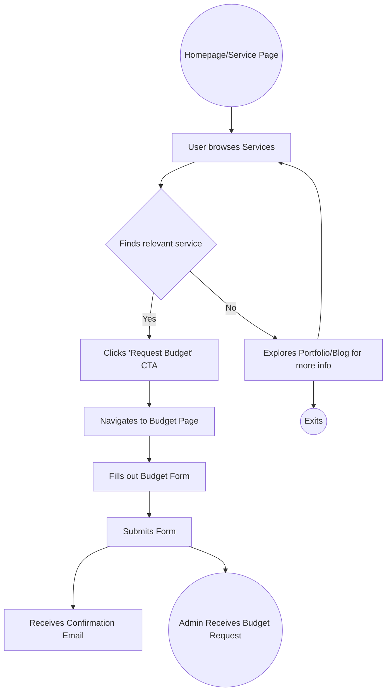
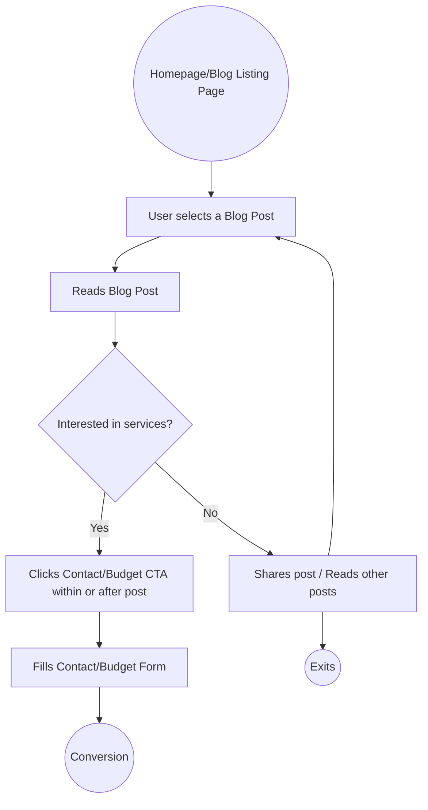
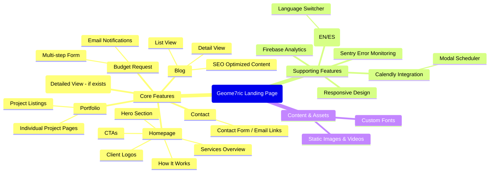

# Geome7ric-Landing Codebase Analysis

**Date of Analysis:** June 2, 2025

## 1. Project Overview

- **Purpose:** Landing page for Geome7ric, showcasing services, portfolio, blog, and providing contact/budgeting functionalities.
- **Core Technologies:** Next.js (App Router), React, TypeScript, Tailwind CSS.
- **Key Features:**
  - Internationalization (English/Spanish)
  - Blog
  - Portfolio Showcase
  - Services Display
  - Budget Request Form
  - Contact Form
  - Calendly Integration
  - Firebase Analytics
  - Sentry Error Monitoring
- **Deployment:** Vercel (inferred from `README.md` and Sentry configuration)

## 2. Software Architect Perspective

### 2.1. Overall Architecture

    *   Monolithic Frontend: Next.js App Router based application.
    *   Server-Side Rendering (SSR) and Static Site Generation (SSG) capabilities via Next.js.
    *   API Routes for backend functionalities (e.g., sending emails, budget requests).
    *   Client-side routing enhanced by Next.js.

### 2.2. Key Architectural Components & Interactions

```mermaid
graph TD
    A[User Browser] --> B{Next.js App Router};
    B --> C[Pages & Layouts (src/app/[locale])];
    C --> D[React Components (src/components)];
    D --> E[State Management (Zustand - src/store)];
    D --> F[Styling (Tailwind CSS)];
    C --> G[API Routes (src/app/api)];
    G --> H[External Services (Resend, Firebase)];
    B --> I[Internationalization (next-intl - src/i18n, messages)];
    B --> J[Error Monitoring (Sentry)];
    B --> K[Analytics (Firebase)];
    D --> L[Static Assets (public/)];
```

### 2.3. Data Flow

- **Page Data:** Primarily fetched server-side via Next.js data fetching methods within page components or through client-side fetching in components.
- **Static Content:** Served from `public/` or imported directly into components.
- **Blog/Portfolio Data:** Likely stored in `src/data/` or fetched from a CMS/backend (though `src/data/blog/blogsData.ts` suggests local data for blogs).
- **User Interactions (Forms):**
  - Client-side validation.
  - Data submitted to Next.js API Routes (`/api/send-email`, `/api/budget`).
  - API Routes interact with external services like Resend for emails.

#### 2.3.1. Example Data Flow: Budget Request



### 2.4. State Management

    *   **Zustand:** Used for global and feature-specific state management (e.g., `blogStore`, `budgetStore`, `calendlyStore`).
    *   **React Context/Props:** For local component state and prop drilling where appropriate.

### 2.5. Internationalization (i18n)

    *   **`next-intl`:** Library used for managing translations.
    *   **Locale-based routing:** `src/app/[locale]/...` structure.
    *   **Translation files:** `messages/en.json`, `messages/es.json`.
    *   **Middleware:** `src/middleware.ts` likely handles locale detection and redirection.
    *   **Language Switcher:** `src/components/LanguageSwitcher.tsx` allows users to change locales.

```mermaid
graph TD
    subgraph i18n System
        Middleware[src/middleware.ts] --> Routing[next-intl Routing];
        Routing --> LocalePages[src/app/[locale]];
        LocalePages --> Components[React Components];
        Components --> UseTranslationsHook[useTranslations];
        UseTranslationsHook --> Messages[messages/en.json, es.json];
        LanguageSwitcher[src/components/LanguageSwitcher.tsx] --> Routing;
    end
    UserRequest --> Middleware;
```

### 2.6. Error Handling & Monitoring

    *   **Sentry:** Integrated for comprehensive error tracking (`sentry.edge.config.ts`, `sentry.server.config.ts`, `next.config.ts` Sentry wrapping).
    *   **Next.js Error Handling:** `global-error.tsx` for handling global errors.
    *   Client-side and server-side error reporting to Sentry.

### 2.7. Styling Architecture

    *   **Tailwind CSS:** Utility-first CSS framework for rapid UI development. Configured in `tailwind.config.ts` and `postcss.config.mjs`.
    *   **Global Styles:** `src/app/globals.css`.
    *   **Component-Specific Styles:** Achieved through Tailwind utility classes directly in JSX.
    *   **Theming:** `next-themes` is present in `package.json`, suggesting dark/light mode capabilities, likely managed via CSS variables updated by Tailwind.

### 2.8. API Design

    *   Next.js API Routes located in `src/app/api/`.
    *   Endpoints:
        *   `/api/send-email`: Handles sending general emails (e.g., contact form).
        *   `/api/send-confirmation`: Sends confirmation emails.
        *   `/api/budget`: Processes budget requests.
    *   RESTful principles likely followed.

```mermaid
graph TD
    ClientComponent[Client-Side Component] -- HTTP Request --> API_Route[Next.js API Route (e.g., /api/budget)];
    API_Route -- Processes Request --> Logic[Business Logic in Route Handler];
    Logic -- Interacts with --> ExternalService[External Service (e.g., Resend)];
    ExternalService -- Response --> Logic;
    Logic -- HTTP Response --> ClientComponent;
```

## 3. Software Developer Perspective

### 3.1. Development Environment & Scripts

    *   **`package.json` Scripts:**
        *   `dev`: Runs Next.js development server with Turbopack (`next dev --turbopack --port 3001`).
        *   `dev:check`: Runs dev server and TypeScript compiler in watch mode concurrently.
        *   `build`: Creates a production build (`next build`).
        *   `start`: Starts the production server (`next start`).
        *   `lint`: Lints the codebase (`next lint`).
        *   `type-check`: Performs TypeScript type checking (`tsc --noEmit`).
        *   `check-all`: Runs linting and type checking.
    *   **TypeScript:** Enforces static typing, configured in `tsconfig.json`. Path aliases (`@/*`) are set up for easier imports.
    *   **ESLint:** For code linting, configured in `eslint.config.mjs`.
    *   **VS Code Settings:** `.vscode/settings.json` and `.vscode/extensions.json` provide editor configurations and recommended extensions.

### 3.2. Core Frameworks & Libraries

    *   **Next.js (^15.1.7):** React framework for building web applications. App Router is used.
    *   **React (^19.0.0):** JavaScript library for building user interfaces.
    *   **TypeScript (^5):** Superset of JavaScript adding static types.
    *   **Tailwind CSS (^3.4.17):** Utility-first CSS framework.
    *   **Zustand (^5.0.4):** Minimalist state management library.
    *   **`next-intl` (^3.26.5):** For internationalization.
    *   **Sentry (@sentry/nextjs ^9.15.0):** Error monitoring.
    *   **Firebase (^11.7.1):** Platform for app development (used for Analytics here - `FirebaseAnalytics.tsx`).
    *   **Resend (^4.2.0):** Email sending service.
    *   **Axios (^1.7.9):** Promise-based HTTP client (likely for API calls from client or server).
    *   **Lucide React (^0.475.0):** Icon library.
    *   **Embla Carousel React / Swiper:** For creating carousels/sliders.
    *   **`@next/third-parties`:** For integrating third-party scripts like Google Analytics.

### 3.3. Code Organization & Conventions

    *   **`src/` directory:** Contains all source code.
        *   **`app/`:** Core of the Next.js App Router.
            *   `[locale]/`: Locale-specific pages and layouts.
                *   `page.tsx`: Entry point for a route segment.
                *   `layout.tsx`: Defines UI shell for route segments.
                *   `blog/`, `portfolio/`, `budget/`: Feature-specific route groups.
            *   `api/`: Server-side API route handlers.
            *   `globals.css`: Global styles.
            *   `favicon.ico`, `robots.ts`, `sitemap.ts`: SEO and metadata files.
        *   **`components/`:** Reusable React components.
            *   Atomic design principles might be partially followed (e.g., `Button.tsx` as an atom).
            *   Feature-specific components (e.g., `Blog.tsx`, `PortfolioPreview.tsx`).
        *   **`data/`:** Static data, e.g., `blog/blogsData.ts`.
        *   **`hooks/`:** Custom React hooks, e.g., `useScrollRestoration.ts`.
        *   **`i18n/`:** Internationalization setup (`request.ts`, `routing.ts`).
        *   **`lib/`:** Utility functions and library initializations (e.g., `firebase.ts`).
        *   **`store/`:** Zustand store definitions.
        *   **`types/`:** TypeScript type definitions.
        *   **`utils/`:** General utility functions.
    *   **`public/`:** Static assets (images, fonts, videos).
    *   **`messages/`:** Translation files for `next-intl`.
    *   **Naming Conventions:** PascalCase for components and types, camelCase for functions and variables.

### 3.4. API Endpoint Details (`src/app/api/`)

    *   **`send-email/route.ts`:**
        *   Likely handles POST requests.
        *   Accepts email details (to, from, subject, body).
        *   Uses Resend to dispatch emails.
    *   **`send-confirmation/route.ts`:**
        *   Similar to `send-email` but for specific confirmation messages.
    *   **`budget/route.ts`:**
        *   Handles POST requests with budget form data.
        *   Validates input.
        *   Sends budget details via email using Resend, possibly to both the client and an admin.

### 3.5. State Management with Zustand (`src/store/`)



- **`blogStore.ts`:** Manages state related to blog posts (fetching, filtering).
- **`budgetStore.ts`:** Handles state for the budget form (form data, submission status).
- **`calendlyStore.ts`:** Manages the visibility of the Calendly modal.
- Each store typically defines its state and actions to modify that state. Components subscribe to these stores to react to state changes.

### 3.6. Internationalization Implementation

    *   **`src/i18n/request.ts` & `routing.ts`:** Configure `next-intl` middleware, pathnames, and locale handling.
    *   **`src/middleware.ts`:** Integrates `next-intl` to manage locale detection from headers, cookies, or path prefixes.
    *   **`messages/en.json`, `es.json`:** Store key-value pairs for translations.
    *   **`useTranslations` hook:** Used within components to access translated strings.
    *   **`LanguageSwitcher.tsx`:** Component allowing users to change the current language, which updates the URL and re-renders the content in the selected language.

### 3.7. Build and CI/CD

    *   **Build Process:** `npm run build` uses `next build` to compile the TypeScript/React code, optimize assets, and prepare for deployment.
    *   **CI/CD:** `.github/workflows/` directory indicates GitHub Actions are used.
        *   `deploy.yml`: Likely handles deployment to Vercel on pushes/merges to the main branch.
        *   `pr-validation.yml`: Runs checks (linting, type-checking, build) on pull requests.

## 4. Product Manager Perspective

### 4.1. Project Purpose & Value Proposition

    *   Geome7ric-Landing serves as the primary digital presence for the Geome7ric brand.
    *   **Value Proposition:** To attract potential clients by showcasing expertise, services, past work (portfolio), and thought leadership (blog), ultimately leading to inquiries and budget requests.

### 4.2. Key Features & User Benefits

    *   **Homepage (`src/app/[locale]/page.tsx`):**
        *   **Hero Section (`Hero.tsx`):** Captures attention, introduces Geome7ric.
        *   **Services Overview (`Services.tsx`):** Clearly outlines what Geome7ric offers.
        *   **Client Showcase (`Clients.tsx`, `BrandScroller.tsx`):** Builds trust and credibility.
        *   **How It Works (`HowItWorks.tsx`):** Explains the engagement process.
        *   **Call to Actions (e.g., `Button.tsx` leading to budget/contact):** Guides users towards conversion.
    *   **Blog (`src/app/[locale]/blog/page.tsx`, `Blog.tsx`, `BlogPreview.tsx`):**
        *   **Benefit:** Positions Geome7ric as experts, improves SEO, provides value to users.
        *   Features: List view, individual post view (`[slug]/page.tsx`), potentially categories/tags (not explicitly seen but common).
    *   **Portfolio (`src/app/[locale]/portfolio/page.tsx`, `ProjectPreview.tsx`):**
        *   **Benefit:** Demonstrates capabilities and past successes.
        *   Features: Grid/list of projects, detailed project pages (`[slug]/page.tsx`).
    *   **Budget Request (`src/app/[locale]/budget/page.tsx`, `Budget.tsx`):**
        *   **Benefit:** Streamlines the process for potential clients to get project estimates.
        *   Features: Multi-step form, clear input fields, submission to backend.
    *   **Contact (`Contact.tsx` integrated into pages, or a dedicated contact page):**
        *   **Benefit:** Provides a direct line of communication.
    *   **Internationalization (`LanguageSwitcher.tsx`, `messages/`):**
        *   **Benefit:** Caters to a broader audience (English and Spanish speakers).
    *   **Calendly Integration (`CalendlyModal.tsx`, `CalendlyScheduler.tsx`):**
        *   **Benefit:** Allows users to easily book meetings/consultations.
    *   **Responsive Design (Implicit with Tailwind CSS):**
        *   **Benefit:** Ensures a good user experience across all devices.
    *   **SEO (`sitemap.ts`, `robots.ts`, `BlogSEOSuccess.md`):**
        *   **Benefit:** Improves visibility in search engine results.
        *   `BlogSEOSuccess.md` and `BlogSEOEnhancements.md` suggest a focus on SEO for blog content.

### 4.3. Target Audience

    *   Businesses or individuals seeking software development services, custom solutions, or digital transformation.
    *   The professional design and content (e.g., blog topics like "IA as a TI partner", "Digital Transformation for SMEs") suggest a B2B focus.

### 4.4. User Flows

#### 4.4.1. User Seeking Services & Requesting a Budget



#### 4.4.2. User Reading Blog & Contacting



### 4.5. Feature Map



## 5. Conclusion

The Geome7ric-Landing project is a well-structured Next.js application designed to serve as an effective online presence. It leverages modern web technologies and best practices, including TypeScript, Tailwind CSS, internationalization, and robust error monitoring. The architecture supports its primary goals of showcasing services, sharing expertise, and generating leads. The codebase is organized logically, making it relatively maintainable and scalable for its current scope.

---

**Note:** Mermaid diagrams are best rendered in a Markdown previewer that supports them.
